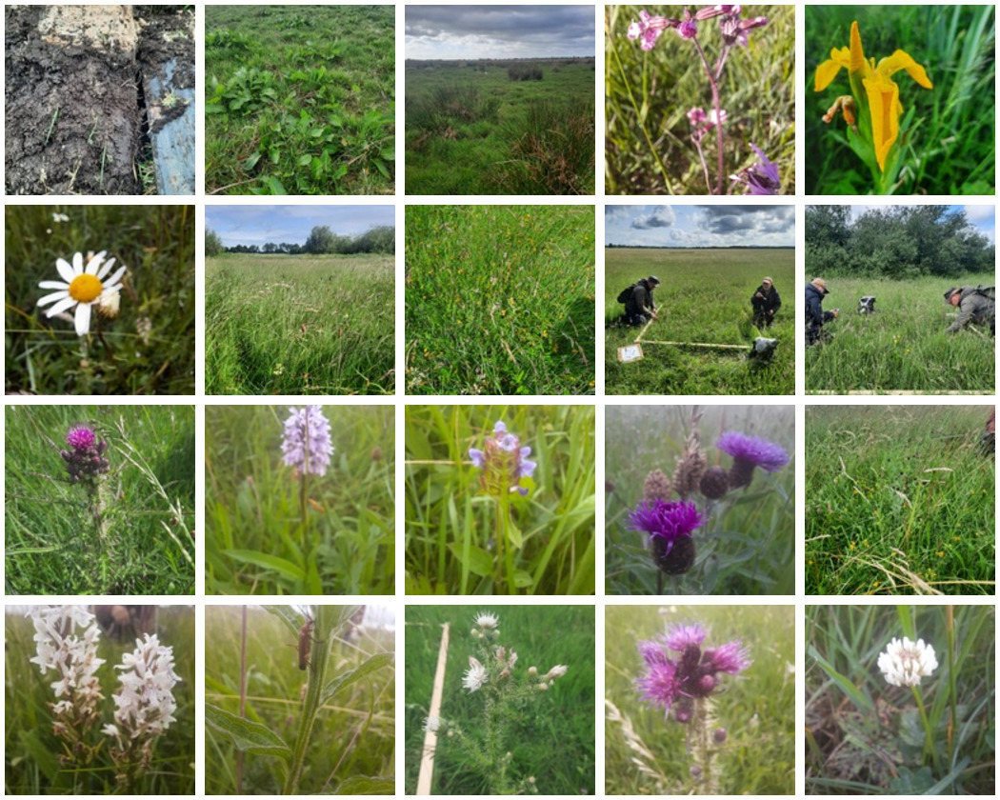

## Dissertation supporting data and statistics scripts
### Student Number: 20106254
### MSc. in Organic & Biological Agriculture

This repository contains the following:

`R-Code`

Scripts used to run statistical analysis against survey data including:
- Non Multidimensional Scaling (NMDS)
- Cluster Analysis
- Kruskal-Wallis Tests

`python`

Python used to extract surveys from VegApp, species statistics, sample data generation etc.

`bash`

Utilities to count surveys

`datasets`

This includes data from the following surveys
- Data from the 2007 Semi Natural Grassland Survey of Site Number 68 on behalf of the NPWS (4 Relevés)
- Data from the 2022 survey by NPWS (4 Relevés)
- Survey data from 2025 (64 Relevés)
- Generated data for testing statistical analysis

This contains an extract retrieved from the National Biodiversity Data Centre.

